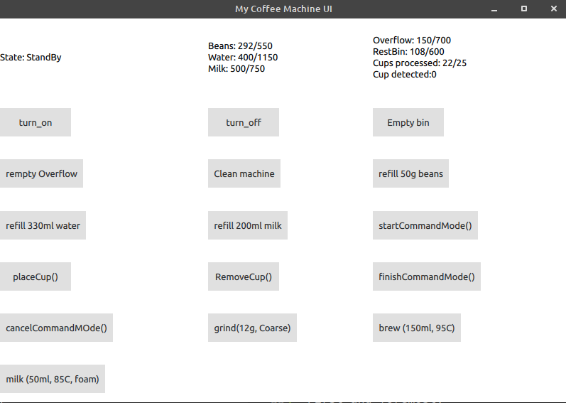

# Bio-Hybrid Coffee Machine

 `. Coffee. Reimagined.`

A Coffee Machine Coding example.

## Table of Contents

  * [Intro](#intro)
  * [Repository Content](#repository-content)
  * [Task](#tasks)
  * [Building](#building)

## Intro

Welcome to Bio-Hybrid coding challenge! \
In the Bio-Hybrid GmbH, we do not only love innovative urban mobility concepts but also coffee.
That's why we created our own automatic coffee machine with many cool features such as adding
custom recipes. However, we still have a very rudimentary UI to control our coffee machine
and would love to have a cool and intuitive user interface.

Maybe you can help us with that?

Here is a screenshot of the rudimentary UI that is included in this project: \
[](./doc/images/screenshot-demo.png)

## Repository Content

You will find in this repository:
* `/third-party`: libraries (to be) used within this project
  * `/libcoffeemaker` : the Bio-Hybrid coffee machine emulator \
    Check the [README.md](./third-party/libcoffeemaker/README.md) to learn more about
    the interface. Also have a look at the demo code.
  * `/libcoffeeweb` : API for getting new recipes \
    Check the [libcoffeeweb README](./third-party/libcoffeeweb/README.md) to learn more about
    the interface. Also have a look at the demo code.
* `/doc` : images and other resources for the documentation.
* `/qml`:
  * `main.qml`: (ugly) sample application to demonstrate interaction with the coffee machine
  * `qml.qrc`: Qt resource config file
* `/`: `main.cc`, `coffee_app.h`, `coffee_app.cc` \
  The current demo application. Your code goes here. You are free to change,
  edit and add files here.

## Tasks

### Mandatory Tasks

Build a functional UI for our coffee machine where the coffee enthusiasts can:
* Select type of coffee from a list / view ... (based on recipe list provided by `libcoffeeweb`)
* Display errors/warnings and task for the user
    * (e.g. if the milk container is empty)

 ### Optional Tasks

* Give the user the ability to:
  * Select a custom grind level (instead of using the value from the recipe)
  * Select a custom beverage size (instead the values from the recipe)
* For user action simulations (e.g. "empty bin", "fill in milk") have a seperate window to avoid
  cluttering the actual coffee machine UI.
* Command line option for the application to load a recipe list from a file or
  instead of (or additionally) the one received via libcoffeeweb.
* Prepare the application multi-language use (Qt)
* Create a custom design.
* Surprise us with additional features.

### Evaluation Criteria

* Code quality (high impact)
  * readability, clarity, reusability
* Structure
* Usability (UI)
* Originality

And no, it does not not have to be perfect.
But you should be able to explain what you did and what was the decision behind it.

#### What is not evaluated?
* Beauty of the used graphics

## Where to start
1. Setup environment and install requirements for the project (see [Building](#building))
2. Build the project
3. Design, Code, Enjoy!

## Notes and Frequently Asked Questions

* The project is very new, so please ask us directly if you have any questions or want to report a bug.
## Building

### Requirements

* Qt >= 5.12
* CMake >= 3.6
* C++17 compiler

For **Ubuntu 20.04 (and later)** you can install to following packages that should fullfill all the
requirements:
* `qml-module-qtquick-layouts`
* `qml-module-qtquick-controls`
* `cmake`
* `make`
* `g++`
* `qtdeclarative5-dev`
* `qt5-default`

### Build Example

* On a Linux system: (Also possible to use QtCreator of course)

```
 git clone ${REPO_URI} MyCoffeeMachine
 cd MyCoffeeMachine
 mkdir build && cd build
 cmake ..
 make
```

* On Windows: \
  It's best to open the `CMakeLists.txt` in the root directory with QtCreator. \
  You can install Qt for example with the Qt offline installer at \
  https://download.qt.io/official_releases/qt/5.12/5.12.10/ \
  * In the installer you should select the Qt MinGW 64bit version and in tools
    also the MinGW compiler.

  And you also need cmake from cmake.org (best to select the "Add to PATH" option in the installer)

