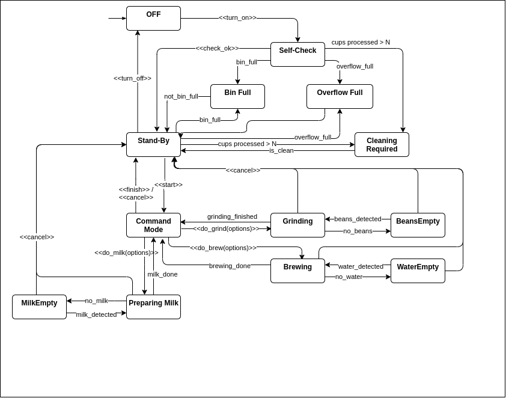

# libcoffeemaker

## Description

This library allows talk to the coffee maker machine, read it's states, start commands
like grinding beans and prepare milk or execute some actions, like emptying the bin
or putting a cup in front of the machine.

## Usage

While the coffeemaker has many states it is easy to use. The interface is available in the
`coffeemaker.h` header file. For details for the states (and also to see what actions
are allowed in certain states see the [state diagram](#coffee-maker-states))

All properties are availalbe as getters and properties (so that it is usable directly in QML).

Example: If you have an instance of the `CoffeeMaker` class (lets say `coffeeMaker`),
you can easily execute actions:
* `coffeeMaker->turnOn()`
* `coffeeMaker->addMilkToContainer(400)`
* `coffeeMaker->startCommandMode()`
* `coffeeMaker->startCommandMode()`
* `...`

Or check for the state and other sensor properties:
* `coffeeMaker->currentState()`
* `coffeeMaker->milkContainerLevel()`
* `...`

All important properties are also available as Qt signals that get emitted if the
property changes, so the developer can easily connect to these and react to changes.

## Important Note

The coffeemaker remembers it's state since the last start and if no config file is found,
random values will be generated for the fill states of the containers.

## Coffee Maker States

The state diagram looks quite complicated, but using the coffeemaker via the
library's API is quiet simple (see also [Usage](#usage))

